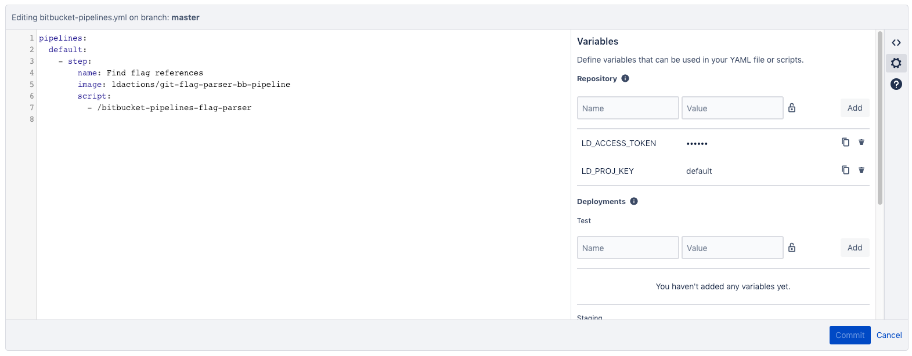

# Bitbucket Pipelines

The flag parser can be used with [Bitbucket Pipelines]](https://bitbucket.org/product/features/pipelines) to automate population of code references in LaunchDarkly.

## Initial setup

1. Create a [LaunchDarkly personal access token](https://docs.launchdarkly.com/docs/api-access-tokens) with writer-level access, or access to the `code-references` [custom role](https://docs.launchdarkly.com/v2.0/docs/custom-roles) resource. Later, we'll use this secret to authenticate our Bitbucket pipeline to LaunchDarkly.
2. Create a new pipelines configuration in your selected Bitbucket repository. If you don't already have a pipeline configuration file, you'll need to create a new Pipelines configuration, by visiting the Pipelines section on your repository's webpage. The pipeline step should run on push, using the `default` configuration, and contain an action which uses `docker://ldactions/git-flag-parser-bb-pipeline` as its docker image. The access token configured in the previous step should be included as a secured variable named `LD_ACCESS_TOKEN`, in addition to a variable named `LD_PROJ_KEY`, set to the desired LaunchDarkly project key. Here's an example of a minimal Pipeline configuration:



  ```yaml
  pipelines:
    default:
      - step:
        name: Find flag references
        image: ldactions/git-flag-parser-bb-pipelines
        script:
          - /bitbucket-pipelines-flag-parser
  ```

3. Once your pipeline has been created, the best way to confirm that the pipeline is executing successfully is to create a new pull request with the workflow file, and verify that the newly created pipeline is succeeding, by visiting the Pipelines page on your repository's webpage. A failing pipeline step is indicative of an invalid configuration.

## Pipeline configuration

The `bitbucket-pipelines-flag-parser` may be configured with additional environment variables to enable more functionality.

| Variable | Description | Default | Required |
|------------------|---------------------------------------------------------------------------------------------------------------------------------------------------------------------------------------------------------------------------------------------------------------------------------------------------------------------------------------------------------------|--------------------------------|----------|
| LD_ACCESS_TOKEN | A LaunchDarkly personal access token with admin-level access. Should be supplied as a secured variable. | n/a | yes |
| LD_PROJ_KEY | A LaunchDarkly project key. The flag parser will search this project for code references in this project. | n/a | yes |
| LD_EXCLUDE | A regular expression defining the files and directories which the flag parser should exclude. | "" | no |
| LD_CONTEXT_LINES | The number of context lines above and below a code reference for the flag parser to send to LaunchDarkly. If < 0, no source code will be sent to LaunchDarkly. If 0, only the lines containing flag references will be sent. If > 0, will send that number of context lines above and below the flag reference. A maximum of 5 context lines may be provided. | "-1" | no |
| LD_BASE_URI | Set the base URL of the LaunchDarkly server for this configuration. Only necessary if using a private instance of LaunchDarkly. | "https://app.launchdarkly.com" | no |
