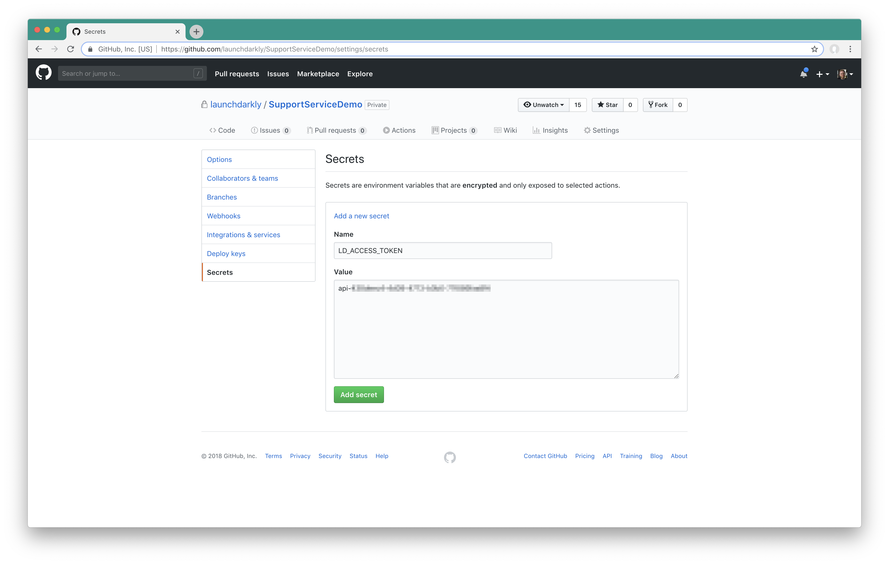
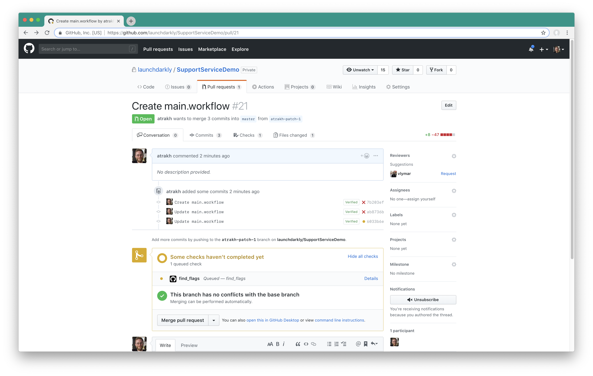
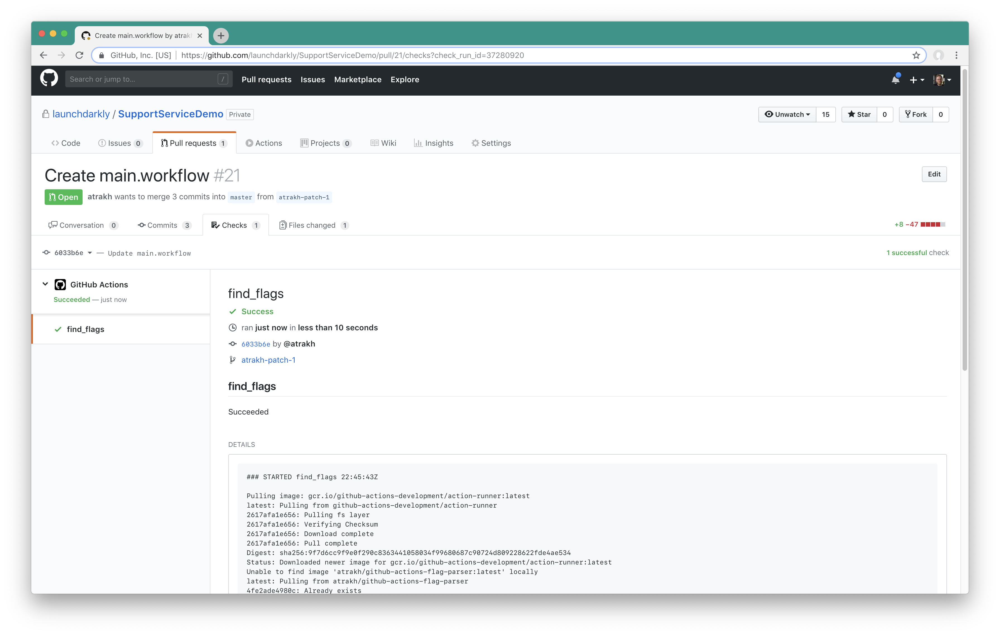

# Github Actions

The flag parser can be used with [GitHub Actions](https://github.com/features/actions) to automate population of code references in LaunchDarkly.

## Initial setup

1. GitHub Actions is currently in open beta. If you haven't signed up already, you may sign up [here](https://github.com/features/actions/signup/).
2. Create a [LaunchDarkly personal access token](https://docs.launchdarkly.com/docs/api-access-tokens) with writer-level access, or access to the `code-references` [custom role](https://docs.launchdarkly.com/v2.0/docs/custom-roles) resource. Store this newly created access token as a secret titled `LD_ACCESS_TOKEN` in your GitHub repository: https://developer.github.com/actions/creating-workflows/storing-secrets/. 
3. Create a new workflow in your selected Github repository. If you don't already have a workflow file, you'll need to create a new file titled `main.workflow` in the `.github` directory of your repository. The workflow should run on the `push` event, and contain an action which uses `docker://ldactions/git-flag-parser-gh-action:latest` as its action provider. The `LD_ACCESS_TOKEN` configured in the previous step should be included as a secret, as well as a new environment variable containing your LaunchDarkly project key. Here's an example of a minimal workflow file configuration:

  ```
  workflow "Find flag references" {
    on = "push"
    resolves = ["find_flags"]
  }
  action "find_flags" {
    secrets = [
      "LD_ACCESS_TOKEN",
    ]
    env = {
      LD_PROJ_KEY = "default"
    }
    uses = "docker://ldactions/git-flag-parser-gh-action:latest"
  }
  ```

4. Once your workflow has been created, the best way to confirm that the workflow executing is to create a new pull request with the workflow file, and verify that the newly created action is succeeding. A failing action is indicative of an invalid configuration.




## Workflow configuration

The `github-actions-flag-parser` may be configured with additional environment variables to enable more functionality.

| Variable | Description | Default | Required |
|------------------|---------------------------------------------------------------------------------------------------------------------------------------------------------------------------------------------------------------------------------------------------------------------------------------------------------------------------------------------------------------|--------------------------------|----------|
| LD_ACCESS_TOKEN | A LaunchDarkly personal access token with admin-level access. Should be supplied as a GitHub secret. | n/a | yes |
| LD_PROJ_KEY | A LaunchDarkly project key. The flag parser will search this project for code references in this project. | n/a | yes |
| LD_EXCLUDE | A regular expression defining the files and directories which the flag parser should exclude. | "" | no |
| LD_CONTEXT_LINES | The number of context lines above and below a code reference for the flag parser to send to LaunchDarkly. If < 0, no source code will be sent to LaunchDarkly. If 0, only the lines containing flag references will be sent. If > 0, will send that number of context lines above and below the flag reference. A maximum of 5 context lines may be provided. | "-1" | no |
| LD_BASE_URI | Set the base URL of the LaunchDarkly server for this configuration. Only necessary if using a private instance of LaunchDarkly. | "https://app.launchdarkly.com" | no |


Here's an example of a workflow configured to exclude the `vendor` directory and send 1 line of context above and below each code reference for each flag in the "default" project:
  ```
  workflow "Find flag references" {
    on = "push"
    resolves = ["find_flags"]
  }
  action "find_flags" {
    secrets = [
      "LD_ACCESS_TOKEN",
    ]
    env = {
      LD_PROJ_KEY = "default"
      LD_EXCLUDE = "vendor/.*"
      LD_CONTEXT_LINES = "1"
    }
    uses = "docker://ldactions/git-flag-parser-gh-action:latest"
  }
  ```
